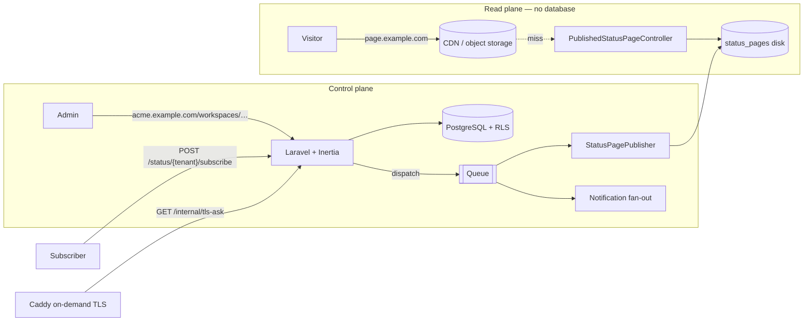

# 01 — Architecture

## What this is

**UpFront** — a multi-tenant status-page platform. The name is the promise: the
page is up, and it is upfront about what is happening. Customers describe their systems as
**components**, report **incidents** and **maintenance windows** against them, and
publish a page their own customers read during an outage. Readers can **subscribe**
to be notified. Pages are reachable at `page.<platform>` or on the customer's own
domain with automatic HTTPS.

## The dominating constraint

> **The status page must survive our own outage.**

A status page that renders from the same database and deployment as the admin app
goes dark during the first real incident — exactly when it matters. Everything
below follows from that one requirement.

The system is therefore split into two planes that share a schema but not a
failure mode:

| Plane | What it does | Depends on | May it fail? |
|---|---|---|---|
| **Control plane** | Admin workspace, auth, CRUD, billing, publishing | PHP, Postgres, queue, Redis | Yes — degrades to "cannot edit" |
| **Read plane** | The published page, its JSON, the widget | Object storage + CDN only | No |

The write path is allowed to fail. The read path is not, so it is given nothing
that can fail: no database, no session, no application logic.

## Stack

| Layer | Choice |
|---|---|
| Runtime | PHP 8.3, Laravel 13 |
| Database | PostgreSQL (Row-Level Security is the isolation mechanism — not portable to SQLite/MySQL) |
| Multi-tenancy | `stancl/tenancy` v3, **single database**, custom RLS bootstrapper |
| Admin UI | Inertia v3 + React 19 + Tailwind v4 ("Orbin" design system) |
| Typed routes | Laravel Wayfinder (`resources/js/routes`, `resources/js/actions`) |
| Auth | Laravel Fortify (login, registration, email verification, 2FA, password reset) |
| Queue | Laravel queue (database driver by default) |
| Published pages | Any S3-compatible object store via the `status_pages` disk |
| Edge | Caddy with on-demand TLS |
| Tests | Pest 4 |

## The four request paths



1. **Read** — a visitor loads a page. Served from object storage. Zero queries,
   zero application code in production.
2. **Write** — an operator edits a component or posts an incident update in the
   workspace. Normal Laravel request, scoped by RLS.
3. **Publish** — any write to a page-visible model queues `PublishStatusPage`,
   which re-renders the flat files.
4. **Notify** — publishing an incident update fans out to confirmed subscribers.

## Route surface

Routes live in three places, deliberately:

| Where | Group | Middleware |
|---|---|---|
| `routes/web.php` | Home + dashboard | `universal`, `InitializeTenancyByDomain`; the dashboard adds `EnsureUserBelongsToTenant` |
| `routes/web.php` | `tenants.*` | `auth`, `verified`, central domain only |
| `routes/web.php` | `workspace.*` under `/workspaces` on a **tenant** domain | `auth`, `verified`, `InitializeTenancyByDomain`, `EnsureUserBelongsToTenant` |
| `routes/settings.php` | Profile, security, appearance | `auth` |
| `bootstrap/app.php` (`withRouting(then:)`) | Published pages, subscriptions, TLS ask | **No `web` group at all** |

That last row is the important one. The published page, the subscribe form, the
confirm/unsubscribe links, and the TLS `ask` endpoint are registered outside the
`web` middleware group on purpose: session, cookies, and CSRF all reach for
storage those requests must not need.

Consequences that follow, and are intentional:

- The subscribe form carries **no CSRF token** — a static file on a CDN cannot hold
  a fresh one, and a stale one would only ever reject real readers. The endpoint is
  throttled by IP instead (`throttle:5,1`), and all an anonymous caller can achieve
  is mailing one confirmation link to an address that must then act on it.
- Confirm and unsubscribe links are authorised by the **token in the URL**, because
  they are clicked from an email where no session exists.

Route ordering matters in one place: `status/by-host` is registered **before**
`status/{tenant}`, or the literal segment would be captured as a tenant key.

## Directory map

```
app/
  Actions/            BuildStatusPageSnapshot (the public view), BuildDashboardOverview
  Console/Commands/   domains:check, status-page:publish
  Enums/              Plan, MembershipRole, ComponentStatus, IncidentStatus, …
  Http/
    Controllers/      Workspace/* (admin CRUD), Published*, Subscription, TlsAsk
    Middleware/       EnsureUserBelongsToTenant
    Requests/         Form request validation per action
  Jobs/               PublishStatusPage, FanOutStatusNotification, DeliverStatusNotification
  Mail/               ConfirmSubscription, StatusUpdateMail
  Models/
    Concerns/         BelongsToTenant, TriggersStatusPagePublish
  Policies/           Per-model authorization, sharing AuthorizesWithinTenant
  Services/
    Dns/              DnsResolver, SystemDnsResolver, DomainVerifier
    StatusPagePublisher.php
  Tenancy/            TenantContext, RowLevelSecurityBootstrapper
resources/
  js/                 Inertia pages, Orbin layout, Wayfinder-generated routes
  views/status-page/  The published page template (self-contained)
  views/mail/         Notification emails
```

## Design rules the code obeys

These are enforced by tests, not just convention. Breaking one should turn the
suite red.

1. **The database isolates tenants, not Eloquent.** No global scope filters by
   `tenant_id`. See [02](02-tenancy-and-isolation.md).
2. **The published read path issues zero queries.** `PublicStatusPageTest` asserts
   the query count is `0`. Adding route-model binding to those routes breaks it.
3. **The published page is self-contained.** No external stylesheet, script, font,
   or image — a page that reports an outage must not fail to render because a CDN
   it does not own is also having one.
4. **Nothing unpublished reaches a published file.** Draft incident updates and
   non-public components are filtered inside `BuildStatusPageSnapshot`.
5. **A certificate is issued only for a hostname whose owner proved control.** See
   [05](05-custom-domains-tls.md).
6. **Nothing is delivered to an unconfirmed address.** See [06](06-notifications.md).
7. **Column defaults are mirrored in `$attributes`.** A database default is not
   applied until after the insert, and the publisher reads values straight off the
   in-memory model. This has bitten `subscribers.channel`, `tenants.timezone`, and
   `domains.verification_status`.

## Where each rule is proved

| Rule | Test |
|---|---|
| Tenant isolation | `tests/Feature/Tenancy/TenantIsolationTest.php`, `RowLevelSecurityPolicyTest.php` |
| Zero-query reads | `tests/Feature/StatusPage/PublicStatusPageTest.php` |
| Membership gate ordering | `tests/Feature/Workspace/WorkspaceAccessTest.php` |
| Certificate gate | `tests/Feature/Domains/TlsAskTest.php` |
| Double opt-in | `tests/Feature/Subscribers/SubscriptionFlowTest.php` |
| Fan-out filtering | `tests/Feature/Subscribers/NotificationFanOutTest.php` |
