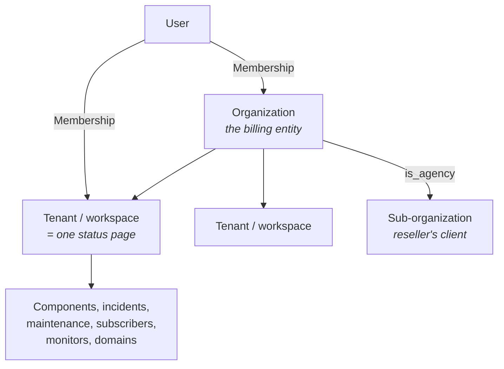

# 02 — Tenancy & isolation

## Three levels



| Level | Table | Owns |
|---|---|---|
| Organization | `organizations` | Plan, quota, Stripe customer, trial, optional parent org for agencies |
| Tenant (workspace) | `tenants` | Exactly one status page: theming, domains, and all page content |
| Resource | `components`, `incidents`, … | The content itself, every row stamped with `tenant_id` |

A user reaches a tenant through a **membership**, which may be scoped to a single
tenant or granted across a whole organization. See [07](07-roles-and-permissions.md).

> **Naming note.** The plan document calls this level a "workspace"; the schema
> calls it a `tenant` because it maps onto the existing `stancl/tenancy` table. The
> UI says "status page". All three mean the same row.

## Isolation is Row-Level Security

Tenant separation is enforced by **PostgreSQL Row-Level Security**, not by Eloquent
global scopes.

Every tenant-scoped table carries:

```sql
ALTER TABLE components ENABLE ROW LEVEL SECURITY;
ALTER TABLE components FORCE ROW LEVEL SECURITY;

CREATE POLICY tenant_isolation ON components
    USING (
        current_setting('app.bypass_rls', true) = 'on'
        OR tenant_id::text = current_setting('app.tenant_id', true)
    )
    WITH CHECK ( … same … );
```

Protected tables (`2026_08_20_152449_enable_row_level_security.php`):

`component_groups`, `components`, `incidents`, `incident_updates`,
`component_incident`, `maintenances`, `component_maintenance`, `subscribers`,
`monitors`.

Central tables — **not** RLS-protected, because they are how a request finds its
tenant in the first place: `users`, `organizations`, `tenants`, `domains`,
`memberships`, `tenant_user`, plus the framework's cache/jobs tables.

### Why the database and not the app

App-level filtering fails **open**: forget one `where` clause and Tenant A's
unpublished incident renders on Tenant B's screen. A database policy fails
**closed**: forget the clause and you see nothing. For a product whose entire value
is being trusted during an outage, that asymmetry decides the design.

### Two requirements that are easy to miss

- **`FORCE ROW LEVEL SECURITY`** — without it, policies do not apply to the table's
  owner, and migrations run as the owner.
- **The app must connect as a role that is `NOSUPERUSER NOBYPASSRLS`** (`status_app`
  locally and in CI). A superuser silently ignores every policy. `.github/workflows/tests.yml`
  has the exact SQL; if the whole suite fails after a machine change, this role is
  usually why.

## `TenantContext`

`app/Tenancy/TenantContext.php` owns the two session variables the policies read.
Nothing else in the app should touch them.

| Method | Effect |
|---|---|
| `apply(int $tenantId)` | Binds the connection to a tenant. Every later query sees that tenant only. |
| `forget()` | Clears the tenant. **Not** a neutral state — with no tenant set, every policy evaluates to NULL and no tenant-scoped row is visible. |
| `withoutIsolation(callable)` | The audited escape hatch. Sets `app.bypass_rls = on`, restores the prior state in `finally` — including when the callback throws. |
| `refresh()` | Re-applies the current state to the connection. Session variables live on the connection, so anything handing back a fresh or reconnected handle must call this. |

`set_config(?, ?, false)` is used rather than `SET` so the value is bound as a
parameter instead of interpolated into DDL-shaped SQL.

## Tenant resolution

Three ways a request acquires a tenant:

| Mode | Where | Middleware |
|---|---|---|
| **By domain** | `page.example.com` and platform subdomains | `InitializeTenancyByDomain` (on the `universal` group, so central domains pass through with no tenant) |
| **By path** | `/workspaces/{tenant}/…` | `InitializeTenancyByPath` + `EnsureUserBelongsToTenant` |
| **None** | Central domain: dashboard, tenant list, settings | Tenant-scoped tables read as empty |

`RowLevelSecurityBootstrapper` is registered **first** in `config/tenancy.php`
under `bootstrappers`, so initializing tenancy and constraining the database are
the same act. The rest of the request assumes the connection is already scoped.

`DatabaseTenancyBootstrapper` is deliberately left commented out — this is
single-database tenancy.

### Path-based tenancy needs a guard

`InitializeTenancyByPath` performs **no authorization**. It initializes whatever id
appears in the URL, and RLS then faithfully scopes the request to exactly that
tenant. Without a check, editing the id in the address bar would walk another
organization's pages with the database's full cooperation.

`EnsureUserBelongsToTenant` is what makes that safe:

```php
$tenant = tenant();
abort_if($tenant === null, 404);
$user = $request->user();
abort_if($user === null, 403);
abort_unless($user->canAccessTenant($tenant), 403);
```

It must run **immediately after** `InitializeTenancyByPath` — which also forgets
the route parameter once resolved, so the tenant is read from the tenancy context
rather than the request. `WorkspaceAccessTest` asserts both the registration *and
the ordering* structurally, because behavioural tests cannot tell the middleware
apart from the policies that also happen to block.

An unidentifiable tenant is mapped to **404**, not 403 — answering 403 would
confirm which tenant ids exist.

## `BelongsToTenant` adds no global scope

```php
trait BelongsToTenant
{
    public static function bootBelongsToTenant(): void
    {
        static::creating(function (self $model): void { /* fill tenant_id */ });
    }
}
```

That is the whole trait: it stamps `tenant_id` on insert so callers need not repeat
it. It deliberately adds **no** global scope. A redundant scope would paper over a
policy that had been dropped or misapplied, and the isolation suite would keep
passing while the guarantee was gone.

The suite is mutation-tested against exactly that: removing `FORCE ROW LEVEL
SECURITY` turns ~74 tests red; granting `BYPASSRLS` to the app role turns ~66 red.

## The escape hatch

`withoutIsolation()` is verbose to call on purpose. Its legitimate callers today:

| Caller | Why |
|---|---|
| `BuildStatusPageSnapshot` | Publishing runs on a worker where no tenant is resolved; it binds the tenant explicitly with `where('tenant_id', …)` instead. |
| `TriggersStatusPagePublish` | Looks up the central `Tenant` row from a model hook. |
| `FanOutStatusNotification` | Iterates one tenant's subscribers from a worker. |
| `SubscriptionController` | Public, session-less, no tenant resolved: finds a subscriber by token. |
| `BuildDashboardOverview::forUser` | Aggregating a user's whole portfolio is genuinely cross-tenant; guarded by an explicit `whereIn` over the tenants that user can reach. |
| `PublishStatusPages` command | Console has no tenant. |
| Test fixtures | Seeding rows for several tenants. |

Any new caller should have a reason of that shape. It is also the mechanism a
future super-admin console will use — with an audit log, which does not exist yet.

## Queues and tenancy

`QueueTenancyBootstrapper` is enabled, so a job dispatched inside a tenant context
re-initializes that tenant when it runs. Two habits keep this honest:

- Jobs in this codebase pass a **plain `tenantId` int**, not an ambient context, and
  re-scope explicitly. `FanOutStatusNotification` and `DeliverStatusNotification`
  both do.
- After a reconnect, session variables are gone. `TenantContext::refresh()` exists
  for that; long-running workers that reconnect must not assume the old scope
  survived.

## Failure modes

| Symptom | Cause |
|---|---|
| Whole suite fails, "permission denied" or empty results everywhere | `status_app` role missing, or app connected as superuser |
| Query returns nothing in a job that works in a request | No tenant applied on the worker's connection — pass `tenant_id` explicitly |
| A write succeeds but the row vanishes | `WITH CHECK` rejected it under a different tenant; check what `app.tenant_id` was at insert time |
| Tests pass but production leaks | Someone added a global scope; remove it and fix the policy instead |
