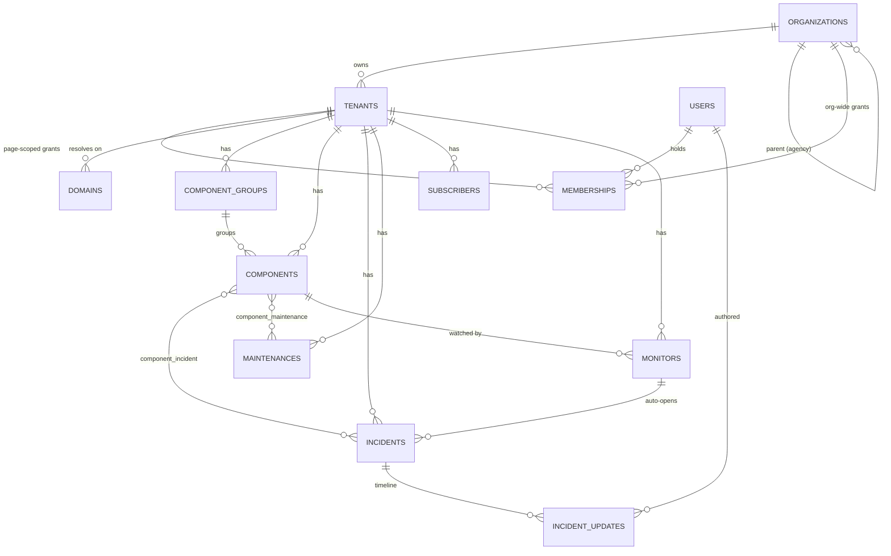

# 03 — Data model

## Entity relationships

## Central tables

Not RLS-protected — these are how a request finds its tenant.

### `organizations` — the billing entity

| Column | Notes |
|---|---|
| `name`, `slug` | Slug unique |
| `plan` | Cast to `Plan` enum; default `free` |
| `is_agency` | Marks a reseller |
| `parent_organization_id` | Set when an agency provisioned this org |
| `tenant_quota` | How many status pages it may create; default 1 |
| `billing_email`, `stripe_customer_id`, `trial_ends_at` | Billing surface (Stripe integration not built yet) |

Behaviour: `hasReachedTenantQuota()`, `isOnTrial()`.

### `tenants` — one workspace = one status page

`stancl/tenancy`'s table, with columns promoted out of its `data` JSON blob so they
can be indexed and joined (`Tenant::getCustomColumns()`).

| Column | Notes |
|---|---|
| `organization_id` | Nullable; cascade on delete |
| `name`, `slug` | Slug unique |
| `published_at`, `last_published_at` | Publication state; `last_published_at` drives `status-page:publish --stale` |
| `headline`, `support_url`, `logo_path` | Page copy |
| `primary_color` (default `#4f46e5`), `custom_css`, `timezone` (default `UTC`) | Theming |
| `show_powered_by` | Default `true`; the free-tier growth loop |

`primary_color`, `timezone`, and `show_powered_by` are **mirrored in `protected
$attributes`** so a freshly created tenant carries them in memory — the publisher
reads them straight off the model before the database default would apply.

### `domains`

`stancl/tenancy`'s table plus verification columns.

| Column | Notes |
|---|---|
| `domain`, `tenant_id` | The hostname and its page |
| `is_primary` | Default `false` |
| `verification_token` | The TXT proof value |
| `verification_status` | `pending` / `verified` / `failed`, default `pending` |
| `verified_at`, `last_checked_at` | Verification history |
| `certificate_issued_at`, `certificate_expires_at` | Read by `domains:check`; Caddy owns the actual lifecycle |

Behaviour: `isCustom()`, `isVerified()`, `mayIssueCertificate()`,
`expectedCnameTarget()`, `markVerified()`, `markVerificationFailed()`. Platform
subdomains are auto-verified on create — there is nothing for the customer to prove.

### `users`

Laravel's table plus Fortify two-factor columns. `CentralConnection`. Behaviour
added here: `memberships()`, `tenants()`, `roleFor(Tenant)`, `canAccessTenant(Tenant)`.

### `memberships`

| Column | Notes |
|---|---|
| `user_id` | Required |
| `organization_id` | Nullable — set for an org-wide grant |
| `tenant_id` | Nullable — set for a page-scoped grant |
| `role` | Cast to `MembershipRole`, default `viewer` |

Unique on `(user_id, organization_id, tenant_id)`. A **tenant-scoped membership
wins** over an org-wide one, so an owner can be demoted on a single page without
losing their role elsewhere.

`tenant_user` (from `stancl/tenancy`) is a separate, older pivot still used by
`Tenant::users()` and `User::tenants()` — the dashboard portfolio reads it.
`TenantController::store` writes **both** rows when a page is created.

## Tenant-scoped tables

All RLS-protected; every row carries `tenant_id`.

### `component_groups`
`name`, `position`, `is_collapsed`.

### `components`
| Column | Notes |
|---|---|
| `component_group_id` | Nullable |
| `name`, `description` | |
| `status` | `ComponentStatus`, default `operational` |
| `position` | Display order |
| `is_public` | Default `true`; **false excludes it from the published snapshot** |
| `show_uptime` | Default `true` |
| `status_changed_at` | |

### `incidents`
| Column | Notes |
|---|---|
| `title`, `slug` | Slug unique per tenant |
| `status` | `IncidentStatus`, default `investigating` |
| `impact` | `IncidentImpact`, default `minor` |
| `is_published` | Default `false` — unpublished incidents never reach a file |
| `opened_by_monitor_id` | Set when a monitor opened it rather than a human |
| `notifications_sent` | |
| `started_at`, `resolved_at` | |

### `incident_updates`
`incident_id`, `author_id` (nullable, `users`), `status`, `body`, `is_ai_drafted`,
`published_at`. **A null `published_at` is a draft** — it stays out of the snapshot
and out of notifications, which is the whole reason drafts exist.

### `component_incident`
Pivot with its own `status` column (default `degraded_performance`): the status a
component had *because of* this incident. Unique on `(incident_id, component_id)`.

### `maintenances`
`title`, `slug`, `description`, `status` (`MaintenanceStatus`), `is_published`,
`auto_transition` (default `true`), `notify_subscribers` (default `true`),
`scheduled_start_at`, `scheduled_end_at`, `started_at`, `completed_at`.

### `component_maintenance`
Plain pivot, unique on `(maintenance_id, component_id)`.

### `subscribers`
| Column | Notes |
|---|---|
| `channel` | `SubscriberChannel`, default `email` (mirrored in `$attributes`) |
| `endpoint` | Email address, webhook URL, Slack webhook, or E.164 number |
| `confirmation_token` | Cleared on confirm |
| `unsubscribe_token` | Globally unique; the authorisation for one-click unsubscribe |
| `confirmed_at`, `unsubscribed_at` | The lifecycle |
| `component_ids` | JSON; **null means every component on the page** |
| `bounce_count` | Hard failures; 5 disables the endpoint |
| `last_notified_at` | |

Unique on `(tenant_id, channel, endpoint)`.

### `monitors`
`component_id` (nullable), `name`, `type` (`MonitorType`), `target`,
`expected_keyword`, `expected_status_code` (default 200), `interval_seconds`
(default 60), `failure_threshold` (default 3), `is_enabled`, `auto_open_incident`
(default `false`), `consecutive_failures`, `last_status`, `last_checked_at`.

> Schema only. The checking engine is not built — see [09](09-operations.md#known-gaps).

## Enums

| Enum | Values | Notable behaviour |
|---|---|---|
| `Plan` | free, starter, growth, agency, enterprise | `monthlyPriceInCents()`, `allowsCustomDomain()`, `showsPoweredByBadge()`, `componentLimit()`, `subscriberLimit()`, `monitorLimit()`. `null` limit = unmetered |
| `MembershipRole` | owner, admin, editor, viewer | `canPublishIncidents()`, `canManageBilling()`, `canManageMembers()` |
| `ComponentStatus` | operational, degraded_performance, partial_outage, major_outage, under_maintenance | `severity()` rolls components up into the page banner — **the worst status wins** |
| `IncidentStatus` | investigating, identified, monitoring, resolved | `isTerminal()` |
| `IncidentImpact` | none, minor, major, critical | `severity()` |
| `MaintenanceStatus` | scheduled, in_progress, completed, cancelled | |
| `MonitorType` | http, tcp, keyword, heartbeat | `isOutbound()` — a heartbeat is inverted: the *absence* of a ping is the failure |
| `DomainVerificationStatus` | pending, verified, failed | `allowsCertificateIssuance()` |
| `SubscriberChannel` | email, slack, webhook, sms, discord, teams | `requiresDoubleOptIn()` (email, sms), `isMetered()` (sms) |

## Plan limits

| | Free | Starter | Growth | Agency | Enterprise |
|---|---|---|---|---|---|
| Price / month | $0 | $19 | $59 | $149 | custom |
| Components | 5 | 25 | 100 | 100 | ∞ |
| Subscribers | 50 | 1,000 | 5,000 | 25,000 | ∞ |
| Monitors | 0 | 20 | 100 | 100 | ∞ |
| Custom domain | ✓ | ✓ | ✓ | ✓ | ✓ |
| "Powered by" badge | shown | hidden | hidden | hidden | hidden |

Enforcement today:

| Limit | Enforced where |
|---|---|
| Subscribers | `SubscriptionController::store` (public sign-up) and `SubscriberController` (admin add) |
| Custom domain | Included in every plan. `TlsAskController` still refuses a certificate until DNS proves ownership |
| Components, monitors | **Defined but not enforced at write time yet** |
| "Powered by" badge | `tenants.show_powered_by`, set per page — not currently forced from the plan |
