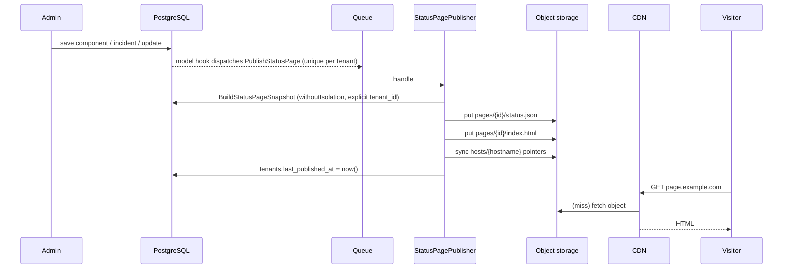

# 04 — Publish pipeline

## Why the page is a file

Rendering the public page from the database would tie its availability to the
availability of the thing it reports on. So the page is **pre-rendered to flat
files** and served from object storage. Once those files exist, reading a status
page needs neither this application nor its database.

The write path is allowed to fail; the read path is given nothing that can.



## What triggers a publish

| Trigger | Mechanism |
|---|---|
| Any save or delete on a page-visible model | `TriggersStatusPagePublish` trait → `PublishStatusPage` job |
| "Publish now" in the workspace | `POST /workspaces/{tenant}/publish` |
| Console | `php artisan status-page:publish {tenant?} [--stale]` |
| Hourly backstop | `status-page:publish --stale` on the scheduler |

`PublishStatusPage` is `ShouldBeUnique` keyed by tenant id. One incident update
typically touches several records and every one of them asks for a republish;
collapsing those into a single pending job keeps a busy incident from queueing
dozens of identical renders — which matters most precisely when the system is
already unhappy. `uniqueFor = 120` stops collapsing once the job has started, so a
change made mid-render still triggers a fresh publish. `tries = 3`, backoff `[5, 30]`,
`timeout = 60`.

The hourly `--stale` sweep is the backstop: it republishes pages never published,
or whose `updated_at` is newer than `last_published_at`, so a lost job cannot leave
a page stale indefinitely.

## The snapshot

`app/Actions/BuildStatusPageSnapshot.php` is **the only place that reads the
database for the public page**. It runs inside `withoutIsolation()` with an explicit
`where('tenant_id', …)`, because publishing happens on workers and in the console
where no tenant is resolved.

What it includes:

```jsonc
{
  "page":    { "name", "headline", "supportUrl", "logoPath", "primaryColor",
               "customCss", "timezone", "showPoweredBy", "subscribeUrl" },
  "status":  { "value", "label", "description" },   // worst component status wins
  "components":   [ { "id", "name", "description", "status", "statusLabel" } ],
  "incidents":    [ { "id", "slug", "title", "status", "impact",
                      "startedAt", "resolvedAt", "components": [],
                      "updates": [ { "status", "body", "publishedAt" } ] } ],
  "maintenances": [ { "id", "slug", "title", "description", "status",
                      "scheduledStartAt", "scheduledEndAt" } ],
  "generatedAt": "…"
}
```

What it **excludes**, and must keep excluding:

| Excluded | Filter |
|---|---|
| Private components | `where('is_public', true)` |
| Unpublished incidents | `where('is_published', true)` |
| Draft incident updates | `filter(fn ($u) => $u->isPublished())` — a null `published_at` is a draft |
| Unpublished or finished maintenance | `is_published` + status in `scheduled`, `in_progress` |

Incidents are capped at the 50 most recent by `started_at`.

### Overall status

The page banner is the **worst** component status present — `ComponentStatus::severity()`
ordered `operational < under_maintenance < degraded_performance < partial_outage <
major_outage`. "Mostly operational" is not a thing customers believe.

### Custom CSS is sanitised at snapshot time

Tenant CSS is written into a file served from a CDN, so it is cleaned before it is
stored, not when it is rendered:

```php
$clean = str_replace('<', '', $css);                       // no tag breakout
$clean = preg_replace('/@import\b[^;]*;?/i', '', $clean);  // no external fetch
```

`@import` is stripped for the same reason the page loads no external asset at all:
a page that reports an outage must not fail to render because someone else's CDN
is also having one.

## Storage layout

Disk `status_pages` (`config/filesystems.php`) — local in development, any
S3-compatible bucket in production via `STATUS_PAGE_*` env vars.

```
pages/{tenantId}/index.html     the rendered page
pages/{tenantId}/status.json    the machine-readable snapshot
pages/{tenantId}/hosts.json     hostnames currently pointing here
hosts/{hostname}                a file whose contents are the tenant id
```

Paths are keyed by **tenant id, not slug** — a slug can be edited, and a published
page must not silently move because someone renamed it.

JSON is written **before** HTML: it is what the widget, the API, and any future
client read, so if the HTML write fails afterwards the page is stale rather than
half-rendered.

### Host pointers

`syncHostPointers()` writes one `hosts/{hostname}` file per **verified** domain and
deletes pointers for hostnames that are no longer verified. This is what lets a
request arriving on a customer's own hostname find its page without a database
lookup. Resolving through the `domains` table would work — and would quietly
reintroduce the dependency the whole pipeline exists to remove.

`unpublish()` deletes the pointers and then the page directory. A status page still
serving after its owner is gone is worse than a 404.

## The read path

`app/Http/Controllers/PublishedStatusPageController.php` is the **origin behind the
CDN**, and the local stand-in for it. In production the CDN serves these objects
directly and never reaches this application.

| Route | Serves |
|---|---|
| `GET /status/{tenant}` | `pages/{tenant}/index.html` |
| `GET /status/{tenant}/status.json` | the snapshot |
| `GET /status/by-host` | resolves `Host` → tenant via the pointer file, then the HTML |
| `GET /status/by-host/status.json` | same, JSON |

Invariants:

- **No database access. At all.** Not for route-model binding, not for a session,
  not for a feature flag. `PublicStatusPageTest` asserts the query count is `0`;
  adding one `DB::table()->count()` turns it red.
- The tenant key is validated with `ctype_digit()` before it reaches the disk
  driver, so a crafted path cannot escape the prefix.
- `getHost()` honours the trusted-proxy configuration, so a forwarded host is only
  believed when it comes from the edge.

Response headers:

```
Cache-Control: public, max-age=30, s-maxage=30, stale-while-revalidate=300, stale-if-error=86400
X-Content-Type-Options: nosniff
```

A short shared cache with a long stale window: during an incident a fresh page
matters, but serving a slightly old one always beats serving an error. `stale-if-error`
of a day is what keeps the page up when the origin is not.

## The page template

`resources/views/status-page/show.blade.php` is fully self-contained — inline CSS,
no `<script>`, no `<link>`, no web font, no remote image. A test asserts the
rendered output contains no external subresource fetch. The subscribe form's
`action` is an exception by nature: it is a user-initiated navigation, not a
subresource, and it points back at this application.

## Operating it

```bash
php artisan status-page:publish            # everything
php artisan status-page:publish 7          # one tenant
php artisan status-page:publish --stale    # never published, or changed since
```

The command reports per-page success and returns a **non-zero exit code on partial
failure** — otherwise a stale page sits there looking healthy.
