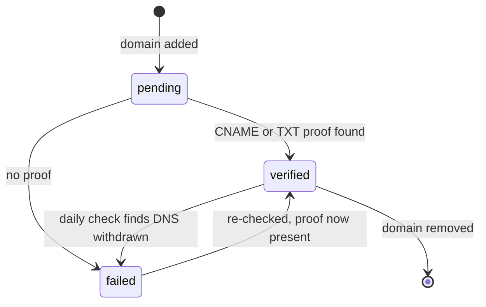
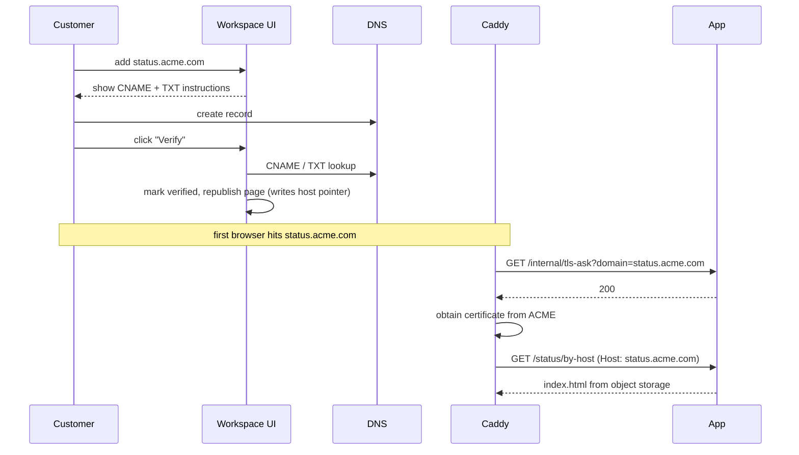

# 05 — Custom domains & TLS

## Two kinds of hostname

| Kind | Example | Verification |
|---|---|---|
| **Platform subdomain** | `acme.laravel-tenancy.test` | Auto-verified on create — it resolves through our own DNS, so there is nothing for the customer to prove |
| **Custom domain** | `status.acme.com` | Must prove control by DNS before anything is issued |

`Domain::isCustom()` decides which, by checking whether the hostname ends in a
configured central domain.

Custom domains require a paid plan (`Plan::allowsCustomDomain()`), and that is
checked in two independent places: `DomainController::store` refuses to add one,
and `TlsAskController` refuses to obtain a certificate for one.

## The threat this design exists to stop

On-demand TLS means the edge will ask about **any** hostname pointed at it,
including names we have never heard of. Answering "yes" makes us obtain a publicly
trusted certificate for that name.

> A platform that will get a valid certificate for any hostname somebody types is a
> phishing tool with a status page attached — and a free tier makes it a free one.

So issuance is gated on proof of ownership, and the gate is a single endpoint.

## Verification

`app/Services/Dns/DomainVerifier.php` accepts **either** proof:

| Proof | Record | Why both |
|---|---|---|
| CNAME | `status.acme.com` → `cname.<platform>` | Required anyway for the page to resolve, so most customers verify simply by finishing setup |
| TXT | `_status-verify.status.acme.com` contains the domain's `verification_token` | For customers whose apex record cannot be a CNAME |

`instructionsFor()` returns the exact records to show in the UI, generated from the
same place the check reads them — getting that pair out of sync generates support
tickets forever.

Resolution goes through the `DnsResolver` interface (`SystemDnsResolver` in
production, `tests/Support/FakeDnsResolver` in tests), so verification is testable
without touching real DNS.



Only `verified` allows certificate issuance (`DomainVerificationStatus::allowsCertificateIssuance()`).

## The `ask` endpoint

`GET /internal/tls-ask?domain=<hostname>` — `app/Http/Controllers/TlsAskController.php`,
throttled `60,1` because the edge asks on every connection attempt to an unknown
name, scanners included.

It answers **200 only when all of these hold**:

1. the hostname passes a cheap shape check (≤ 253 chars, valid label syntax), so
   obvious junk never reaches the database;
2. we have a `domains` row for it;
3. its `verification_status` is `verified` — **the one that carries the weight**;
4. the owning organization has a plan at all. Every plan now includes custom
   domains, so this only refuses a tenant with no organization, whose billing
   state is unknown.

Every refusal is a **404**, never a 403 or a message. Caddy treats any non-2xx as
"do not issue", and there is no reason to tell an unauthenticated caller which
hostnames we know about. Refusals are logged with a reason — a spike here is the
signal that somebody is pointing hostnames at the platform to see what sticks.

## Edge configuration

Caddy, from the controller's own docblock:

```caddyfile
{
    on_demand_tls {
        ask http://app:8000/internal/tls-ask
        interval 2m
        burst 5
    }
}

https:// {
    tls { on_demand }

    # Customer hostnames resolve to a page by Host, so the origin needs
    # no route per domain.
    rewrite * /status/by-host
    reverse_proxy app:8000
}
```

The rewrite is why there is no route per customer domain: the origin resolves the
forwarded `Host` against a pointer file written at publish time. See
[04 — Host pointers](04-publish-pipeline.md#host-pointers).

## End-to-end flow



## Ongoing checks

`php artisan domains:check` runs **daily** on the scheduler. Certificates renew
automatically, but only while the customer's DNS still points at us — checking
daily is what turns a silent expiry into a warning before browsers start showing
one.

It deliberately does **not** revoke a domain on a single failed lookup. Transient
resolver failures are common; flipping a working page to unverified because one
lookup timed out would be a self-inflicted outage.

`certificate_issued_at` / `certificate_expires_at` are read but not yet written —
Caddy owns the certificate lifecycle, and nothing currently reports it back.

## Primary domain

`is_primary` marks the canonical hostname for a page. `DomainController::makePrimary`
clears and sets the flag through the **query builder**, not the model: the
in-memory model may already hold `is_primary = true`, in which case `forceFill`
marks nothing dirty and the write silently does nothing.

## Failure modes

| Symptom | Check |
|---|---|
| Browser shows a certificate error | Is the domain `verified`? Does the plan allow custom domains? Hit `/internal/tls-ask?domain=…` and read the log line |
| Verified, certificate fine, page 404s | Host pointer missing — republish the page (`status-page:publish {id}`) |
| Verification never succeeds | Compare the live records against `instructionsFor()`; the CNAME target is `cname.<first central domain>` |
| Certificate issued for a name we do not own | Should be impossible — that is the `ask` endpoint failing. Treat as a security incident |
