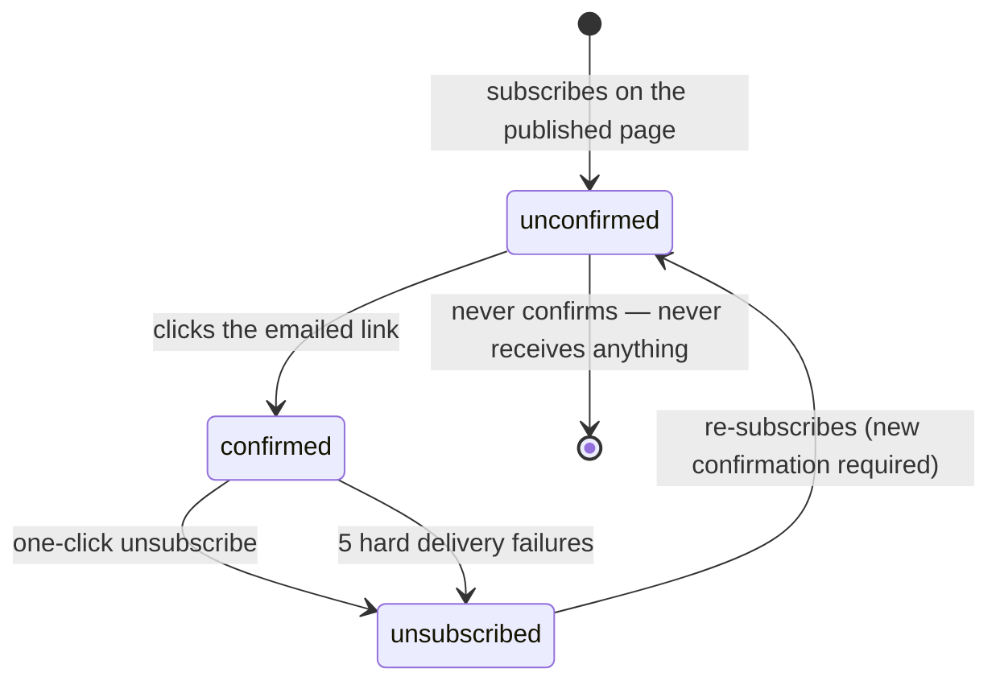
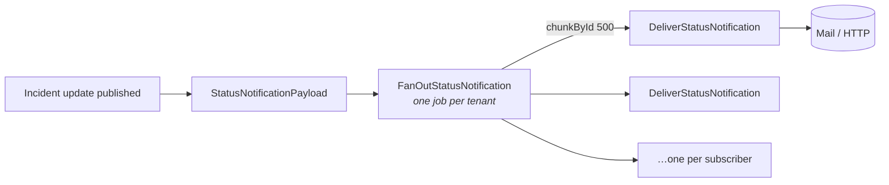

# 06 — Notifications

## Subscriber lifecycle



`Subscriber::isDeliverable()` is the single predicate: confirmed, not
unsubscribed. Nothing is ever delivered to an address that has not confirmed.

**Why double opt-in is enforced in the model rather than left to the caller:** every
tenant sends through the same reputation. One page harvesting addresses and mailing
them unasked would degrade deliverability for all of them.

## Subscribing

The published page is a static file on a CDN, so its form posts back to the
application. Reads stay on the CDN; only the write comes here.

`POST /status/{tenant}/subscribe` — `throttle:5,1`, no session, no CSRF token.
See [01 — Route surface](01-architecture.md#route-surface) for why that is safe.

Three properties of `SubscriptionController::store` that are deliberate:

| Property | Reason |
|---|---|
| Returns a **View**, not a redirect | There is no session to flash errors into — the form was submitted from a static file that may not even be on this domain |
| **Identical response** whether the address is new, already subscribed, or over the plan limit | Otherwise the form becomes a way to test whether someone is subscribed to a page |
| Re-subscribing a **confirmed** address sends nothing | Otherwise the form is a way to mail a stranger repeatedly by typing their address |

Validation is `email:rfc` — **not** `email:rfc,dns`. The `dns` rule performs a live
MX lookup, which makes an anonymous endpoint depend on a resolver and lets a slow
lookup hold the request open. Domains that do not accept mail are caught by bounce
handling, which has to exist regardless.

Plan subscriber limits are enforced **here**, at sign-up: refusing is honest,
whereas accepting an address and silently never mailing it is not.

## Confirm and unsubscribe

| Route | Authorisation | Throttle |
|---|---|---|
| `GET /subscriptions/confirm/{token}` | `confirmation_token` in the URL — cleared on use | `20,1` |
| `GET /subscriptions/unsubscribe/{token}` | `unsubscribe_token`, globally unique | `20,1` |

Both are clicked from an email where no session and no CSRF token exists; the token
*is* the authorisation.

Unsubscribe is **one click, no login, no confirmation step**. Anything slower gets
reported as spam instead — and a spam complaint costs every tenant on the shared
sending domain.

`StatusUpdateMail` carries the headers that make mail clients honour that:

```
List-Unsubscribe: <https://…/subscriptions/unsubscribe/{token}>
List-Unsubscribe-Post: List-Unsubscribe=One-Click
```

## Fan-out



Split in two on purpose: fanning out is a single cheap query, delivering is
thousands of slow network calls, and the two must not share a failure mode. If one
address times out, the other 39,999 should still go.

### `FanOutStatusNotification`

`timeout = 300`, `tries = 3`. Subscribers are read with `chunkById(500)` rather
than loaded at once — a page with 40k confirmed addresses would otherwise hydrate
40k models inside one worker.

Two filters decide who gets a job:

1. `isDeliverable()` — confirmed and not unsubscribed.
2. `followsAnyAffectedComponent()` — a subscriber who chose specific components is
   not paged about an incident that touches none of them. Page-wide events (no
   components named) still reach everyone, and `component_ids = null` means "all".

### `DeliverStatusNotification`

One job per subscriber, so a single dead webhook or refused mailbox retries on its
own instead of taking a whole batch with it. `timeout = 30`, `tries = 3`, backoff
`[10, 60, 300]`.

**Deliverability is re-checked at the moment of sending**, not just at fan-out:
someone who unsubscribed while a large fan-out was still draining must not receive
the tail of it.

Channels:

| Channel | Delivery |
|---|---|
| `email` | `StatusUpdateMail` |
| `slack` | JSON post: `text` + a `section` block |
| `discord` | JSON post: `{ content }` |
| `teams` | JSON post: `{ text }` |
| `webhook` | JSON post: `{ page, event }` — the full payload |
| `sms` | **No-op.** Metered, and arrives with the billing work; delivering it silently for free would invert the margin on the cheapest plan |

Outbound HTTP: JSON, 10-second timeout, identified user agent, `->throw()` so a
non-2xx counts as a failure.

### Rate limiting

```php
RateLimiter::for('status-notifications', fn (DeliverStatusNotification $job) => Limit::perMinute(
    (int) config('services.notifications.per_tenant_per_minute', 300),
)->by((string) $job->tenantId));
```

Applied through the job's `middleware()` as `new RateLimited('status-notifications')`.

Keyed **by tenant**, which is the point: an incident at a page with 40,000
subscribers would otherwise occupy every worker and delay delivery for every other
tenant — and the tenants being delayed are having their own incident, because that
is when notifications happen. Over the limit, the job is *released back to the
queue*, not dropped.

Tunable with `NOTIFICATIONS_PER_TENANT_PER_MINUTE` (default 300).

### Bounces

A hard failure increments `bounce_count`; a success resets it to zero and stamps
`last_notified_at`. At **5** consecutive failures the subscriber is unsubscribed.

Continuing to send to a dead mailbox is what turns a shared sending reputation into
a blocked one, and every other tenant pays for it.

## What triggers a notification

| Event | Notifies |
|---|---|
| Incident update posted with `publish = true` | Yes |
| Held draft later approved (`POST …/updates/{update}/publish`) | Yes — approving a held draft *is* a publish |
| Incident update saved as a draft | No. A draft exists precisely so somebody can read it before thousands of people do |
| Component status changed on its own | No |
| Maintenance window created or transitioning | **No — not wired up.** `StatusNotificationPayload::forMaintenance()` exists but nothing calls it |

## Payload

`StatusNotificationPayload` is a plain value object (`forIncidentUpdate()`,
`forMaintenance()`, `toArray()`) carrying `heading`, `status`, `body`,
`componentNames`, and `componentIds`. Jobs pass the **array**, not the model —
serialising a model into a queue payload would re-fetch it under whatever tenant
context the worker happened to have.

## Failure modes

| Symptom | Check |
|---|---|
| Nobody received an update | Was it published? Are subscribers `confirmed_at` and not `unsubscribed_at`? |
| Some subscribers skipped | Their `component_ids` may not include any affected component |
| Delivery slow for one tenant only | The per-tenant rate limit is doing its job — raise `NOTIFICATIONS_PER_TENANT_PER_MINUTE` if intended |
| Subscribers silently unsubscribing | `bounce_count` reached 5; check the `Status notification delivery failed` log lines |
| SMS subscriber never notified | Expected — SMS delivery is a deliberate no-op |
