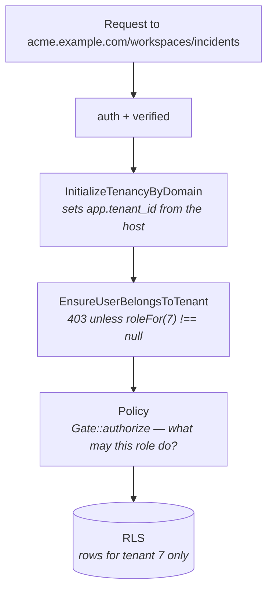

# 07 — Roles & permissions

## Who exists

| Level | Authenticated? | Reaches | Defined by |
|---|---|---|---|
| **Visitor** | No | The published page and its JSON | Nothing — the page is public |
| **Subscriber** | No | Confirm / unsubscribe links | A token in the URL |
| **Viewer** | Yes | One page, read-only | `Membership` with role `viewer` |
| **Editor** | Yes | One page, may publish incidents | role `editor` |
| **Admin** | Yes | Everything on a page, including destructive changes and members | role `admin` |
| **Owner** | Yes | Admin + billing | role `owner` |
| **Agency** | Yes | Several organizations via `parent_organization_id` | Schema exists; the reseller console does not |
| **Platform operator** | Yes (shell) | Everything, through `withoutIsolation()` | **No super-admin UI yet** |

## How a membership is resolved

A `Membership` row grants a role either on **one tenant** (`tenant_id` set) or
across **a whole organization** (`organization_id` set). `User::roleFor(Tenant)`
resolves them:

```php
// A tenant-scoped membership wins over an organization-wide one, so an owner
// can be demoted on a single page without losing their role elsewhere.
$direct = $this->memberships->firstWhere('tenant_id', $tenant->getTenantKey());
if ($direct !== null) { return $direct->role; }

return $this->memberships->first(fn ($m) => $m->isOrganizationWide()
    && $m->organization_id === $tenant->organization_id
    && $tenant->organization_id !== null)?->role;
```

`User::canAccessTenant(Tenant)` is `roleFor() !== null` — that is what the
workspace middleware calls.

## Capability matrix

| Capability | Viewer | Editor | Admin | Owner |
|---|:--:|:--:|:--:|:--:|
| View components, incidents, maintenance, subscribers, domains | ✓ | ✓ | ✓ | ✓ |
| Create / update components | ✗ | ✓ | ✓ | ✓ |
| Create / update incidents, post updates, publish drafts | ✗ | ✓ | ✓ | ✓ |
| Create / update maintenance windows | ✗ | ✓ | ✓ | ✓ |
| Add domains, verify, set primary | ✗ | ✓ | ✓ | ✓ |
| Add a subscriber manually | ✗ | ✓ | ✓ | ✓ |
| **Delete** components, incidents, maintenance, domains, subscribers | ✗ | ✗ | ✓ | ✓ |
| Manage members | ✗ | ✗ | ✓ | ✓ |
| Manage billing | ✗ | ✗ | ✗ | ✓ |

Derived from `MembershipRole`:

- `canPublishIncidents()` — everyone except `viewer`. This is `canWrite()`.
- `canManageMembers()` — `owner` and `admin`. This is `canAdminister()`.
- `canManageBilling()` — `owner` only.

**Why deletion needs admin and editing does not:** deleting a component silently
rewrites published incident history. Viewers are read-only on purpose; most of what
they see is on the public page anyway once published.

## Three layers of enforcement



Each layer answers a different question, and none is redundant:

| Layer | Question | If it were missing |
|---|---|---|
| `EnsureUserBelongsToTenant` | *May this user be here at all?* | Typing another organization's subdomain would walk their pages, with the database's full cooperation — `InitializeTenancyByDomain` performs no authorization of its own |
| Policy | *What may this role do here?* | An invited viewer could delete components |
| Row-Level Security | *Which rows exist for this request?* | A forgotten `where` clause would leak across tenants |

The middleware ordering is asserted **structurally** in
`tests/Feature/Workspace/WorkspaceAccessTest.php`, not just behaviourally: with the
middleware removed, the policies still block most actions, so a behavioural test
stays green while the guarantee is gone.

## Policies

All tenant policies share `AuthorizesWithinTenant`, which reads the role from the
already-resolved tenant — by the time a policy runs, the question is never "which
tenant?" but "what may this user do here?".

| Policy | `create`/`update` | `delete` | Extra |
|---|---|---|---|
| `ComponentPolicy` | write | administer | |
| `ComponentGroupPolicy` | write | administer | |
| `IncidentPolicy` | write | administer | `comment` (post/publish an update) = write |
| `MaintenancePolicy` | write | administer | |
| `DomainPolicy` | write | administer | |
| `SubscriberPolicy` | write | administer | |

> Gotcha: `Gate::authorize('delete', Component::class)` fatals — these policy
> methods take an instance. Pass the model.

## Public access

The published page has no authorization at all: it is a file in a bucket. Anything
that must not be public is filtered out at **snapshot** time, not at request time —
private components, unpublished incidents, and draft updates never reach the file.
See [04](04-publish-pipeline.md#the-snapshot).

Private / audience-specific pages (magic-link gated) are a planned feature and do
not exist yet.

## Known gaps

- **Two notions of "my pages" existed.** `memberships` grants access; the
  `tenant_user` pivot does not, because it carries no role. `User::accessibleTenants()`
  is now the single query behind both the page list and the portfolio dashboard,
  so what a user is shown matches what the gate will let them open.
- **No member-management UI.** Memberships are created only when a page is
  provisioned — registration writes an organization-wide `owner` membership, and
  `TenantController::store` writes a tenant-scoped one. Inviting a colleague
  currently means inserting a row.
- **No super-admin console and no audit log.** Cross-tenant access exists only as
  `TenantContext::withoutIsolation()` from a shell. Planned for Phase 7, along with
  impersonation.
- **No break-glass admin.** Nothing distinguishes a platform operator from a
  customer in the schema.
