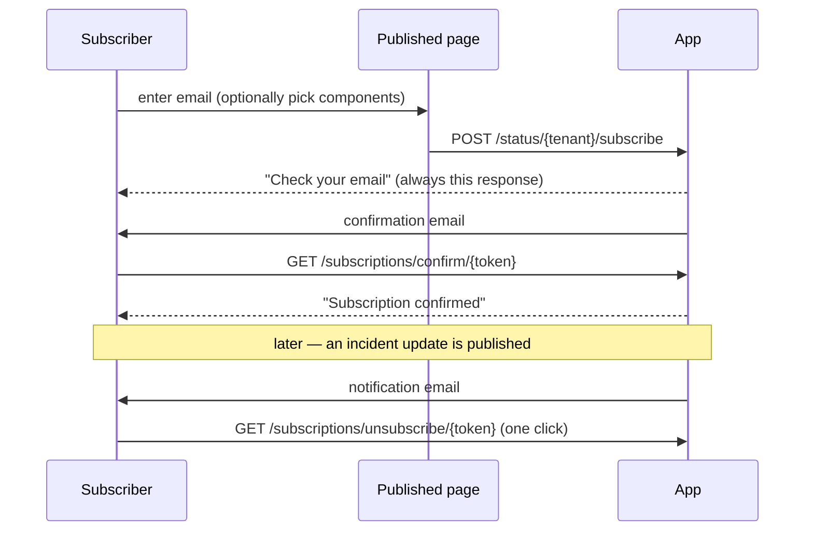

# 08 — Operating guide, by user level

How the system is actually used, from the outside in. Each level assumes nothing
from the ones above it.

Capabilities referenced here are defined in [07](07-roles-and-permissions.md).

---

## Level 0 — Visitor

**Who:** anyone checking whether a service is down. No account, no login.

**Where:** `https://acme.<platform>` (platform subdomain), `https://status.acme.com`
(customer domain), or `http://<app>/status/{tenantId}` in development.

**What they see:**

- A banner with the **worst** current component status. If one component is in a
  major outage, the page says major outage — not "mostly operational".
- Each public component and its status.
- Published incidents, newest first (50 max), each with its timeline of published
  updates.
- Scheduled and in-progress maintenance windows.
- A subscribe form.
- A "powered by" badge on free-tier pages.

**What they can do:**

| Action | How |
|---|---|
| Read the page | Just load it |
| Read it as JSON | `GET …/status.json` — same data, for a dashboard or script |
| Subscribe | The form on the page |

**Why the page loads when everything else is down:** it is a flat file on a CDN. No
database, no application code, no external stylesheet or font. See
[04](04-publish-pipeline.md).

---

## Level 1 — Subscriber

**Who:** a visitor who wants to be told, rather than to keep refreshing.

**Flow:**



**Notes for support:**

- The response is **always** "check your email", whether the address is new,
  already subscribed, or the page is at its plan limit. That is deliberate — the
  form must not reveal who is subscribed.
- An address that already confirmed and re-submits receives **nothing**. If someone
  says "I never got the confirmation", check whether they are already confirmed.
- Choosing specific components means they are only notified about incidents that
  touch at least one of them. Page-wide updates still reach everyone.
- Unsubscribe is one click, no login. Mail clients can do it from their own UI via
  the `List-Unsubscribe` header.
- After 5 hard delivery failures the address is unsubscribed automatically.
- **SMS subscribers receive nothing today** — delivery is a deliberate no-op until
  metering exists.

---

> **Where the workspace lives.** Administration is on the page's own domain, with
> no page id in the URL: `https://acme.example.com/workspaces/components`. The
> tenant comes from the host, so there is nothing to edit in the address bar. The
> central domain hosts sign-up, the portfolio dashboard, and the page list; the
> workspace paths do not exist there and answer 404.

## Level 2 — Viewer

**Who:** a stakeholder who should see the workspace but must not change it —
support leads, execs, a client on an agency plan.

**Where:** sign in on the central domain, then `/dashboard`.

**What they can do:**

- See the portfolio dashboard: every page they belong to, component counts, open
  incidents, confirmed subscribers, status breakdown, recent incidents, upcoming
  maintenance.
- Open any page they are a member of and read Components, Incidents, Maintenance,
  Subscribers, Domains, Page settings.

**What they cannot do:** anything that writes. Every create, update, and delete is
refused by policy.

---

## Level 3 — Editor

**Who:** whoever is on call. This is the level the product is designed around.

### Report an incident

1. `/workspaces/incidents` on your page's domain → **New incident**.
2. Title, impact (`none` / `minor` / `major` / `critical`), affected components,
   and whether to publish.
3. Save. If published, the page republishes automatically — no separate "publish"
   step to forget.

### Post an update

1. Open the incident.
2. Choose the new status: `investigating` → `identified` → `monitoring` → `resolved`.
3. Write the body.
4. **Publish now** (default) or save as a draft.

Publishing does three things in one request: writes the update, moves the
incident's own status, and fans out to subscribers. Choosing `resolved` stamps
`resolved_at`.

A **draft** does none of that: it does not move the incident's public status, does
not appear on the page, and does not notify. It exists precisely so somebody can
read it before thousands of people do. Approving it later (**Publish**) behaves
exactly like a directly posted update, notification included.

### Change a component's status

`/workspaces/components` → edit. The page banner recalculates to the worst
status present and republishes.

Marking a component non-public removes it from the published page entirely while
keeping its history internally.

### Schedule maintenance

`/workspaces/maintenance` → new window, with start and end times and affected
components. Published windows appear on the page while `scheduled` or `in_progress`.

> Maintenance windows do **not** notify subscribers today, and `auto_transition`
> is stored but not yet driven by a scheduled job. Announce them in an incident
> update if subscribers need to hear about one.

### Manage the page's look

`/workspaces/settings` — name, headline, support URL, logo URL, primary
colour, timezone, custom CSS, "powered by" badge. Saving republishes.

Custom CSS is sanitised on publish: `<` is stripped and `@import` removed, because
the result is written into a file served from a CDN.

**Force a republish:** the **Publish** button on that screen, or
`php artisan status-page:publish {id}`.

---

## Level 4 — Admin

Everything an editor can do, plus:

- **Delete** components, incidents, incident updates, maintenance windows,
  subscribers, and domains. Deletion is admin-only because removing a component
  silently rewrites published incident history.
- Manage members — **the schema supports this; there is no UI yet.**

### Connect a custom domain

1. `/workspaces/domains` → add `status.acme.com`. Requires a paid plan.
2. The screen shows the exact records:
   - **CNAME** `status.acme.com` → `cname.<platform>`, or
   - **TXT** `_status-verify.status.acme.com` = the verification token.
3. Create one of them at the DNS provider.
4. Click **Verify**. Either proof is accepted.
5. Once verified, the page republishes and writes a host pointer; the first browser
   request triggers automatic certificate issuance at the edge.
6. Optionally set it **primary** to make it the canonical hostname.

Troubleshooting is in [05](05-custom-domains-tls.md#failure-modes).

### Manage subscribers

`/workspaces/subscribers` lists them with their state. Admins can add an
address manually (still subject to the plan limit) and remove one. Removing is not
the same as unsubscribing — it deletes the record.

---

## Level 5 — Owner

Everything an admin can do, plus **billing**: plan, quota, billing email.

> Stripe is not integrated. `organizations` carries `plan`, `tenant_quota`,
> `stripe_customer_id`, and `trial_ends_at`, and plan limits are read from the
> `Plan` enum, but there is no checkout, no webhook, and no subscription
> management. Plans are set directly in the database today.

### Create a status page

`/tenants` → name + subdomain. This creates the tenant, its platform subdomain, the
`tenant_user` pivot row, and an **owner** membership for the creator — without that
last part, the creator cannot reach the page they just made.

---

## Level 6 — Agency / reseller

**Status: modelled, not built.**

The data model supports it: `organizations.is_agency`, `parent_organization_id` for
sub-organizations, `tenant_quota` for how many pages an org may create, and
organization-wide memberships so one login reaches every client page.

What exists today: an agency user with an org-wide membership sees all of that
organization's pages in the dashboard and can switch between them from one session
— which is why the workspace lives on the central domain with the tenant in the
path rather than on each client's domain.

What does not exist: reseller billing, a sub-tenant provisioning UI, per-client
white-labelled sending domains.

---

## Level 7 — Platform operator

**Who:** whoever runs the deployment. No UI — this level is a shell.

There is no super-admin console and no impersonation yet. Cross-tenant work goes
through the one audited escape hatch:

```php
app(App\Tenancy\TenantContext::class)->withoutIsolation(function () {
    // every tenant's rows are visible in here
});
```

Nothing else in the application may bypass isolation, and there is no audit log of
who used it. Treat every call as a privileged action.

Day-to-day commands:

```bash
php artisan status-page:publish --stale   # republish anything gone stale
php artisan status-page:publish 7         # republish one page
php artisan domains:check                 # re-verify custom domains
php artisan queue:work                    # drain publishes and notifications
php artisan pail                          # tail application logs
```

Full runbook: [09](09-operations.md).

---

## Quick reference

| I want to… | Level | Where |
|---|---|---|
| Check if a service is down | Visitor | The published page |
| Get told when it changes | Subscriber | Subscribe form on the page |
| Watch without touching | Viewer | `/dashboard` |
| Report an outage | Editor | `/workspaces/incidents` |
| Post an update during one | Editor | The incident's timeline |
| Announce planned downtime | Editor | `/workspaces/maintenance` |
| Rebrand the page | Editor | `/workspaces/settings` |
| Use my own domain | Admin | `/workspaces/domains` |
| Delete something | Admin | Any list screen |
| Change the plan | Owner | Database, for now |
| Create another page | Owner | `/tenants` |
| Fix a stale page | Operator | `php artisan status-page:publish {id}` |
