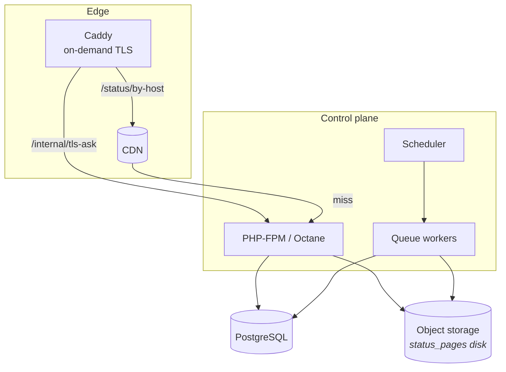

# 09 — Operations

## Local setup

Beyond the base setup in the root [README](../README.md), two things are specific
to this application.

### 1. PostgreSQL, with a non-superuser role

Isolation is Row-Level Security, so **the app must not connect as a superuser** — a
superuser silently ignores every policy and the isolation suite passes against an
unprotected database.

```sql
CREATE ROLE status_app LOGIN PASSWORD 'status_app' NOSUPERUSER NOBYPASSRLS;
CREATE DATABASE laravel_tenancy      OWNER status_app;
CREATE DATABASE laravel_tenancy_test OWNER status_app;
```

`.github/workflows/tests.yml` has the authoritative version. If the whole suite
fails after a machine change, this role is usually why.

```env
DB_CONNECTION=pgsql
DB_DATABASE=laravel_tenancy
DB_USERNAME=status_app
DB_PASSWORD=status_app
```

### 2. Wildcard subdomains

Tenant pages resolve at `*.{CENTRAL_DOMAIN}`. Laravel Herd handles this locally.

```env
CENTRAL_DOMAIN=laravel-tenancy.test
SESSION_DOMAIN=.laravel-tenancy.test
```

Then:

```bash
php artisan migrate
composer run dev      # server + queue worker + log tail + vite
```

`composer run dev` runs a **queue worker**, which matters: publishes and
notifications are queued, so without one a page never updates.

## Environment

| Variable | Purpose | Default |
|---|---|---|
| `CENTRAL_DOMAIN` | The platform domain. Tenants live at `*.{this}`; the CNAME target is `cname.{this}` | `laravel-tenancy.test` |
| `SESSION_DOMAIN` | Must be `.{CENTRAL_DOMAIN}` so a session survives across subdomains | — |
| `DB_*` | PostgreSQL, connecting as a `NOBYPASSRLS` role | pgsql |
| `QUEUE_CONNECTION` | Publishes and notifications are queued | `database` |
| `STATUS_PAGE_DISK_DRIVER` | `local` in development, `s3` in production | `local` |
| `STATUS_PAGE_BUCKET`, `_REGION`, `_ENDPOINT`, `_ACCESS_KEY_ID`, `_SECRET_ACCESS_KEY`, `_USE_PATH_STYLE` | The published-page object store | — |
| `STATUS_PAGE_URL` | Public base URL of that bucket / CDN | — |
| `NOTIFICATIONS_PER_TENANT_PER_MINUTE` | Per-tenant delivery rate cap | `300` |
| `MAIL_*` | Confirmation and notification mail | log driver locally |

## Production topology



Deployment notes:

- **Put the object store behind a CDN, in a different failure domain from the app.**
  The whole design assumes reads survive the control plane being down. If the CDN
  falls back to the origin on every request, that assumption is quietly false.
- Trusted proxies must be configured, or `getHost()` will not honour the forwarded
  host and `/status/by-host` cannot resolve a customer domain.
- Run at least one queue worker. Publishes and notifications both depend on it.
- Run the scheduler (`php artisan schedule:work` or a cron entry).

## Scheduled work

| Command | Cadence | Purpose |
|---|---|---|
| `domains:check` | daily | Re-verify custom domains and surface certificates that will lapse — a certificate renews only while the customer's DNS still points at us |
| `status-page:publish --stale` | hourly | Backstop: republish anything never published or changed since its last publish, so a lost job cannot leave a page stale indefinitely |

## Runbook

### A page is stale

1. Is a worker running? `php artisan queue:work`
2. Failed jobs? `php artisan queue:failed`
3. Force it: `php artisan status-page:publish {tenantId}`
4. Still stale — check the `status_pages` disk credentials; the publisher throws on
   write failure (`'throw' => true`).

### A custom domain shows a certificate error

1. `curl -i 'http://<app>/internal/tls-ask?domain=status.acme.com'` — expect `200`.
2. On `404`, read the `Declined certificate issuance` log line; it names the reason:
   unknown hostname, ownership not verified, or plan does not include custom domains.
3. Verification failing? Compare live DNS against `DomainVerifier::instructionsFor()`.
4. Certificate fine but the page 404s → the host pointer is missing. Republish.

### Notifications are not arriving

1. Was the incident update actually **published**? Drafts never notify.
2. Are the subscribers `confirmed_at` and not `unsubscribed_at`?
3. Do their `component_ids` include an affected component?
4. Backed up? The per-tenant rate limit releases jobs back to the queue by design —
   raise `NOTIFICATIONS_PER_TENANT_PER_MINUTE` if that is intended.
5. Grep for `Status notification delivery failed`; five failures unsubscribe an
   endpoint.

### A user gets 403 on their own page

Membership, not the `tenant_user` pivot, is what grants access — the pivot row
carries no role. Check `User::roleFor($tenant)`; if it is null the user has a
pivot row but no `memberships` row, and both the workspace and the tenant-domain
dashboard will refuse them.

### The whole test suite fails

Almost always the database role. See [Local setup](#1-postgresql-with-a-non-superuser-role).

### The admin UI renders blank

A stale `public/hot` file pointing at a dead Vite server. Delete it, then
`pnpm run build` or `pnpm run dev`.

## Testing

```bash
php artisan test --compact
php artisan test --compact --filter=TenantIsolation
vendor/bin/pint --dirty --format agent    # required after touching PHP
pnpm run lint:check && pnpm run types:check
```

Security-critical behaviour is **mutation-tested** — the protection is deliberately
broken to prove the tests catch it. Known-good results:

| Mutation | Effect |
|---|---|
| Drop `FORCE ROW LEVEL SECURITY` | ~74 tests fail |
| Grant `BYPASSRLS` to the app role | ~66 tests fail |
| Add one query to the published read path | `PublicStatusPageTest` fails |
| Remove `EnsureUserBelongsToTenant` | `WorkspaceAccessTest` structural test fails |

If a change to isolation, publishing, certificates, or delivery does **not** move
these numbers, the test is not proving what it claims.

## Known gaps

Carried forward, and deliberate — not defects to be discovered later:

| Area | State |
|---|---|
| **Billing** | No Stripe. `organizations` carries the columns; plans are set in the database. Component and monitor limits are defined but unenforced |
| **Monitoring engine** | `monitors` table and `MonitorType` exist; nothing checks anything or auto-opens incidents |
| **Maintenance notifications** | `StatusNotificationPayload::forMaintenance()` exists but is never called; `auto_transition` is stored, not driven |
| **SMS** | Deliberate no-op until metering exists |
| **Super-admin** | No console, no impersonation, no audit log; cross-tenant work is `withoutIsolation()` from a shell |
| **`GET /tenants`** | Not scoped to the caller's memberships |
| **Member management** | No invite UI; memberships are inserted directly |
| **Certificate telemetry** | `certificate_issued_at` / `certificate_expires_at` are read but never written |
| **Component groups** | Schema and model exist; no UI |
| **Logo** | A URL field, not an upload |
| **Uptime history, REST API, private pages, widget** | Planned, not started |

## Recurring bug pattern

A column default defined **only** in the database is `null` on a freshly created
model — the default is not applied until after the insert, and the publisher reads
values straight off the in-memory model. This has bitten three times:
`subscribers.channel`, `tenants.timezone`, and `domains.verification_status`.

Factories usually set the value, so tests do not catch it.

**When adding a column with a default, mirror it in `protected $attributes`.**
